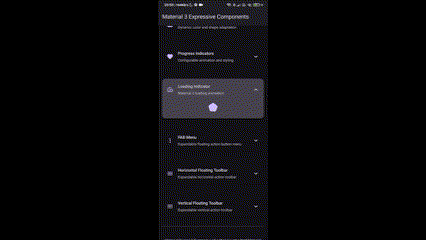

 

<h1 align="center">Material Design 3 Expressive</h1>
 

  
  
  
  

 

## 🌈 Overview

This project showcases enhanced Material Design 3 components with expressive animations, fluid
transitions, and interactive elements, pushing the boundaries of what's possible with Material
Expressive.

## ✨ Key Features

1. **Animated Button Groups**: Enhanced button groups with fluid animations, haptic feedback, and
   scale effects
2. **Expressive Expandable Cards**: Interactive cards with smooth open/close transitions and dynamic
   content
3. **Color-Adjustable Components**: Interactive components that allow real-time color customization
   with HLS controls
4. **Animated Filter Chips**: Responsive chip groups with animated transitions and haptic feedback
5. **FAB Menus & Toolbars**: Floating action buttons that expand into menus and interactive toolbars
6. **Enhanced Progress Indicators**: Custom progress indicators with animated properties

## 🎬 Component Demonstrations

<table>
  <tr>
    <td valign="top" width="50%">
      <h3>📱 Button Groups</h3>
      
Fluid animations and interactive transitions

      
      <ul>
        <li>Scale animations</li>
        <li>Haptic feedback</li>
        <li>Multi-selection support</li>
      </ul>
    </td>
    <td valign="top" width="50%">
      <h3>🔍 Filter Chips</h3>
      
Animated selection with haptic feedback

      
      <ul>
        <li>Color transitions</li>
        <li>Interactive response</li>
        <li>Single and multi-selection modes</li>
      </ul>
    </td>
  </tr>
  <tr>
    <td valign="top" width="50%">
      <h3>📑 Expandable Cards</h3>
      
Smooth expansion and interactive animations

      
      <ul>
        <li>Animated expansion effects</li>
        <li>Elevation changes</li>
        <li>Content transitions</li>
      </ul>
    </td>
    <td valign="top" width="50%">
      <h3>🎨 Color Adjustable Card</h3>
      
Dynamic color and shape adaptation

      
      <ul>
        <li>Real-time HSL controls</li>
        <li>Shape morphing</li>
        <li>Interactive elements</li>
      </ul>
    </td>
  </tr>
  <tr>
    <td valign="top" width="50%">
      <h3>⚡ FAB Menu</h3>
      
Expandable action buttons with fluid transitions

      
      <ul>
        <li>Animated expansion</li>
        <li>Icon transitions</li>
        <li>Multiple action options</li>
      </ul>
    </td>
    <td valign="top" width="50%">
      <h3>🧰 Floating Toolbars</h3>
      
Horizontal and vertical floating action toolbars

      
      <ul>
        <li>Dynamic positioning</li>
        <li>Expandable interfaces</li>
        <li>Both orientation support</li>
      </ul>
    </td>
  </tr>
</table>

## 🚀 Implementation Highlights

- **Motion & Animation**: Implements fluid animations using Compose's animation APIs
- **Material Expressive Integration**: Full support for dynamic colors and Material 3 design
  language
- **Accessibility**: Enhanced semantic descriptions and haptic feedback
- **Interactive Components**: Rich interactive behaviors with visual and haptic feedback
- **Dynamic Theming**: Components adapt to both light and dark themes
- 

## 🛠️ Technologies Used

- **Jetpack Compose**: Modern UI toolkit
- **Material Design 3**: Latest Material design language
- **Kotlin**: 100% Kotlin codebase
- **Material Expressive**: Dynamic color and theming support

## 🔍 Component Showcase

Each component is designed to enhance standard Material Design 3 components with more expressive
behaviors:

- **Button Groups**: Enhanced interactions, scale effects, and haptic feedback
- **Filter Chips**: Animated selections with customizable visuals
- **Expandable Cards**: Fluid transitions with customizable content
- **Color Adjustable Components**: Interactive HSL color controls
- **Loading Indicators**: Customizable progress indicators
- **FAB Menus**: Expandable floating action button systems
- **Floating Toolbars**: Horizontal and vertical expandable toolbars

## 📱 Getting Started

1. Clone the repository
2. Open the project in Android Studio
3. Run the app on a device or emulator running Android 7.0+ (API 24+)
4. Explore the component showcase to see all the enhanced Material Design 3 components

## 📝 Requirements

- Android Studio Arctic Fox or newer
- Android SDK 24+
- Kotlin 1.8+